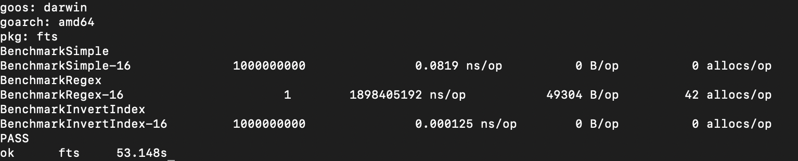

# FTS 

FTS is a practice project which implement a inveret index.

## Full-Text Search Solution

### SQL LIKE Solution

```go
if strings.Contains(doc.Text, term) {
	result.Add(doc)
}
```

### Regex Solution

```go
re, err := regexp.Compile(`(?i)\b` + term + `\b`)
...
if re.MatchString(doc.Text) {
	result.Add(doc)
}
```

### Invert Index Solution

```go
...
tokens := s.Normailze(s.Tokenize(term))

ids := make([]int, 0, 1)

for _, tok := range tokens {
  subIDs := s.index[tok]
  if len(ids) == 0 {
    ids = subIDs
  } else {
    ids = s.intersection(ids, subIDs)
  }
}
return s.findDocs(ids), nil
```

### Benchmark



## References
- [let's build a full-text search engine](https://artem.krylysov.com/blog/2020/07/28/lets-build-a-full-text-search-engine/)
- [source data](https://dumps.wikimedia.org/enwiki/latest/enwiki-latest-abstract1.xml.gz)